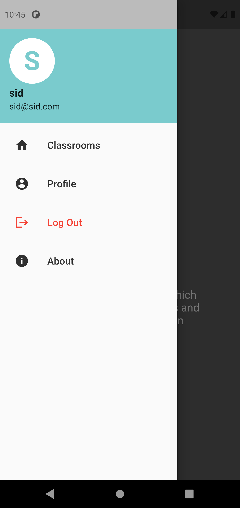
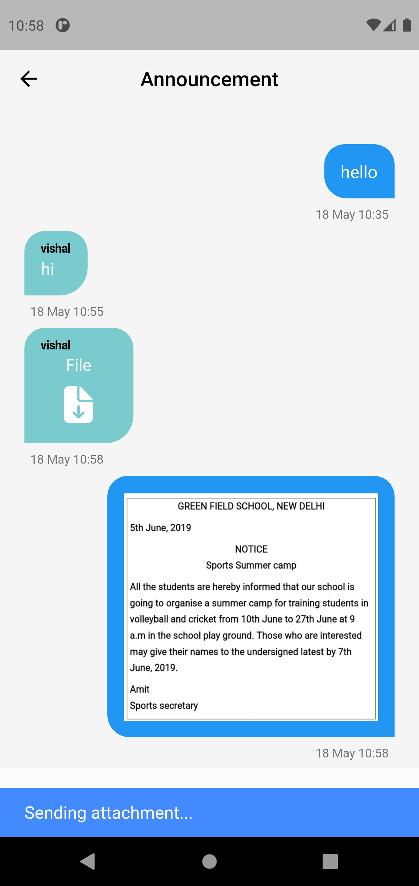

# Shelf
Shelf is a group chat and resource sharing app specially created for classroom purpose.

## Screenshots

<table>
  <tr>
       <td style="text-align: center;"width=30%;">Splash screen</td>
       <td style="text-align: center;"width=30%;">Signin screen</td>
       <td style="text-align: center;"width=30%;">Register screen</td>
  </tr>
  <tr>
       <td></td>
       <td></td>
       <td></td>
  </tr>
</table>
<table>
  <tr>
       <td style="text-align: center;"width=30%;">Invalid login</td>
       <td style="text-align: center;"width=30%;">Home screen</td>
       <td style="text-align: center;"width=30%;">Classroom creation</td>
  </tr>
  <tr>
       <td></td>
       <td></td>
       <td></td>
  </tr>
</table>
<table>
  <tr>
       <td style="text-align: center;"width=30%;">Navigation bar</td>
       <td style="text-align: center;"width=30%;">Search screen</td>
       <td style="text-align: center;"width=30%;">Channel screen</td>
  </tr>
  <tr>
       <td></td>
       <td></td>
       <td></td>
  </tr>
</table>
<table>
  <tr>
       <td style="text-align: center;"width=30%;">Channel creation</td>
       <td style="text-align: center;"width=30%;">Chatroom</td>
       <td style="text-align: center;"width=30%;">File picker</td>
  </tr>
  <tr>
       <td></td>
       <td></td>
       <td></td>
  </tr> 
</table>
<table>
  <tr>
       <td style="text-align: center;"width=30%;">Sending attachment Snackbar</td>
       <td style="text-align: center;"width=30%;">Image viewer</td>
       <td style="text-align: center;"width=30%;">File Download notification</td>
  </tr>
  <tr>
       <td></td>
       <td></td>
       <td></td>
  </tr> 
</table>
<table>
  <tr>
       <td style="text-align: center;"width=30%;">Profile page</td>
       <td style="text-align: center;"width=30%;">About page</td>
  </tr>
  <tr>
       <td></td>
       <td></td>
  </tr> 
</table>